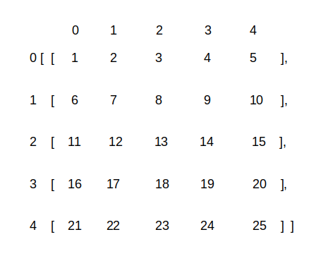
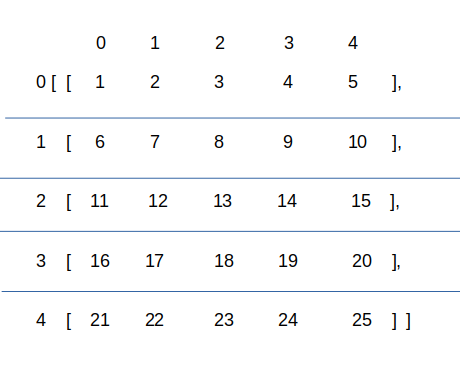
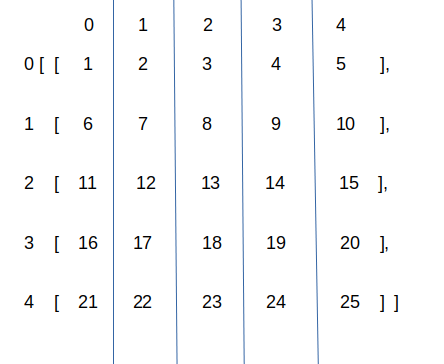
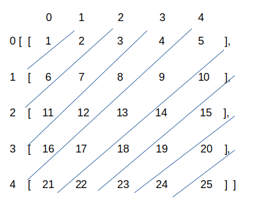
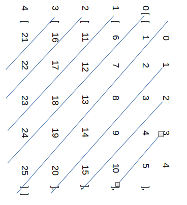

# tttzen

### Text based tic tac toe on node

This project is a text based two player tic tac toe game that runs on node.
I chose javascript as the language because it is more forgiving.

The game asks for each players name then asks for the size of the grid by n.
The gameboard will be a n by n board.
The gameboard can go up to 99 by 99 and any further the checking for win algorithm still works but the board is misaligned.

The game creates two arrays to store values.
One array is for display because players need to see the position number and so that the grid they see aligns properly.
The other array is for the checking for win algorithm.

## The checking for win algorithm
```javascript
function checkWin(player) {
    checkHorizontalWin(player, checkArray);
    checkVerticalWin(player);
    checkDiagonalWin(player, checkArray);
    checkOtherDiagonalWin(player);
    if (turn == maxTurns) {
        console.log("Game over, all positions filled!");
        rl.close();
    }
}
```

I test for a win from four directions.
### The Horizontal check

```javascript
function checkHorizontalWin(player, array) {
    var chwArray = [];
    var superString = "";
    var regularExp = false;

    //First I combine each array into a string
    for (let i = 0; i < gridBy; i++) {
        var tempArray = array[i].join("");
        chwArray.push(tempArray);
    }

    //Then all the arrays are converted into a string seperated by n
    //Then tested as a regular expression for a consecutive x or o
    superString = chwArray.join("n");
    regularExp = /(x{3,3})|(o{3,3})/.test(superString);

    if (regularExp) {
        win(player);
    }
}
```
Combine the arrays into strings, then seperate them by "n" and finally use a regular expression to look for three consecutive x or o.
### The Vertical check

```javascript
function checkVerticalWin(player) {
    var cvwArray = [];

    for (let i = 0; i < gridBy; i++) {
        var tempArray = [];
        //Push each element from the i position in each array into tempArray
        for (let j = 0; j < gridBy; j++) {
            tempArray.push(checkArray[j][i]);
        }
        cvwArray.push(tempArray);
    }
    checkHorizontalWin(player, cvwArray);
}
```
I prepare an array to use the horizontal check on.
### The Diagonal check

```javascript
function checkDiagonalWin(player, array) {
    var cdwArray = [];
    var newArray = [];
    var superString = "";
    var regularExp = false;

    //This takes the 45 degrees to the right arrays
    //For the bigger half of a triangle
    for (let i = 0; i < gridBy; i++) {
        var tempArray = [];
        for (let j = 0; j <= i; j++) {
            tempArray.push(array[j][i-j]);
        }
        cdwArray.push(tempArray);
    }

    //This takes the lower half
    for (let i = 1; i < gridBy; i ++) {
        var tempArray = [];
        let k = i;
        for (let j = gridBy-1; j >= i; j--) {
            tempArray.push(array[k][j]);
            k++;
        }
        cdwArray.push(tempArray);
    }

    //This joins the arrays like the horizontal check
    for (let i = 0; i < cdwArray.length; i ++) {
        var tempArray = cdwArray[i].join("");
        newArray.push(tempArray);
    }

    superString = newArray.join("n");
    regularExp = /(x{3,3})|(o{3,3})/.test(superString);

    if (regularExp) {
        win(player);
    }
}
```
This was the hardest. I input the top half diagonal values first then the bottom half into strings and use the same method as horizontal to test for win.
### The Other Diagonal check

```javascript
function checkOtherDiagonalWin(player) {
    var codwArray = [];

    for (let i = 0; i < gridBy; i++) {
        var tempArray = [];
        for (let j = gridBy; j > 0; j--) {
            tempArray.push(checkArray[j-1][i]);
        }
        codwArray.push(tempArray);
    }
    checkDiagonalWin(player, codwArray);
}
```
For the other diagonal I flipped the board first so that I could perform the diagonal check on it.


